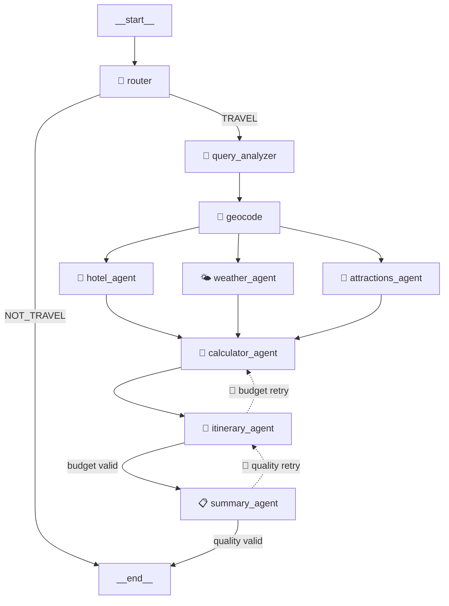

# 🌍 AI Travel Agent

An intelligent, agentic travel planner powered by **LangGraph** and **Groq LLM** that generates personalized, budget-aware trip itineraries with real-time data.

Give it a plain-English request like _"Plan me a 5-day trip to Tokyo with a $2000 budget"_ and it will research hotels, check weather forecasts, find attractions, convert currencies, and produce a polished day-by-day Markdown travel plan — all automatically.

---

## ✨ Features

- 🔀 **Smart Routing** — Classifies queries as travel or non-travel; gracefully rejects off-topic requests
- 🧠 **Natural Language Parsing** — Extracts destination, dates, budget, currency, and interests from free-form text
- ⚡ **Parallel Data Gathering** — Fetches hotels, weather, and attractions simultaneously for faster results
- 🧮 **Budget Calculator** — Converts currencies and allocates budget (40% hotel, 25% food, 15% activities, 10% transport, 10% misc)
- 📝 **Itinerary Composer** — Creates detailed day-by-day plans with meals, activities, and cost estimates
- 📋 **Summary & Export** — Produces a polished Markdown report saved as `trip_plan_<city>.md`
- 🔄 **Self-Correcting Feedback Loops** — Automatically retries if budget is exceeded or sections are missing (max 2 retries)

---

## 🏗️ Architecture



| Line Type | Meaning |
|-----------|---------|
| **Solid →** | Unconditional edge (`add_edge`) |
| **Dotted -.->** | Conditional feedback loop (`add_conditional_edges`) |

### Pipeline Stages

| # | Node | Description |
|---|------|-------------|
| 1 | **Router** | Classifies input as `TRAVEL` or `NOT_TRAVEL` |
| 2 | **Query Analyzer** | Parses natural language into structured `TravelRequest` |
| 3 | **Geocode** | Converts city name → latitude/longitude |
| 4a | **Hotel Agent** | Searches for affordable hotels via Tavily |
| 4b | **Weather Agent** | Fetches daily forecast from Open-Meteo |
| 4c | **Attractions Agent** | Finds attractions matching user interests |
| 5 | **Calculator Agent** | Converts currency & computes budget breakdown |
| 6 | **Itinerary Agent** | Composes day-by-day plan with budget validation |
| 7 | **Summary Agent** | Formats final Markdown report with quality checks |

---

## 🛠️ Tech Stack

| Component | Technology | Cost |
|-----------|-----------|------|
| **Orchestration** | [LangGraph](https://github.com/langchain-ai/langgraph) | Open source |
| **LLM** | [Groq](https://groq.com/) (Llama 3.3 70B) | Free tier |
| **Search** | [Tavily](https://tavily.com/) | Free tier |
| **Weather** | [Open-Meteo](https://open-meteo.com/) | Free, no key |
| **Currency** | [Frankfurter](https://www.frankfurter.app/) | Free, no key |
| **Geocoding** | [Nominatim / OSM](https://nominatim.org/) | Free, no key |

---

## 🚀 Getting Started

### Prerequisites

- Python 3.10+
- [Groq API Key](https://console.groq.com/) (free)
- [Tavily API Key](https://tavily.com/) (free)

### Installation

```bash
# Clone the repository
git clone https://github.com/Divyanshu-hash/Travel-Agent.git
cd Travel-Agent

# Create virtual environment
python -m venv venv
venv\Scripts\activate        # Windows
# source venv/bin/activate   # macOS/Linux

# Install dependencies
pip install -r requirements.txt
```

### Configuration

Create a `.env` file in the project root (see `.env.example`):

```env
GROQ_API_KEY=your_groq_api_key_here
TAVILY_API_KEY=your_tavily_api_key_here
```

### Usage

Open `travel_agent.ipynb` in Jupyter and run all cells, or modify the prompt in the demo cell:

```python
itinerary = plan_trip(
    "Plan me a 3-day trip to Paris, "
    "my budget is 1000 EUR, "
    "I like art museums and French cuisine, "
    "and my home currency is USD."
)
```

The agent will output a detailed plan and save it as `trip_plan_Paris.md`.

---

## 📂 Project Structure

```
Travel-Agent/
├── travel_agent.ipynb   # Main notebook (full pipeline)
├── requirements.txt     # Python dependencies
├── .env                 # API keys (not committed)
├── .env.example         # Template for required keys
├── trip_plan_*.md       # Generated trip plans (output)
└── README.md
```

---

## 📸 Example Output

```
════════════════════════════════════════════════════════════
  🌍  AI TRAVEL AGENT  
════════════════════════════════════════════════════════════

📩 Your request:
   "Plan me a 3-day trip to Paris, budget 1000 EUR..."

🔀 Routing query...
   ✅ Classified as TRAVEL request

🧠 Analyzing your travel request...
   📍 Destination : Paris
   📅 Days        : 3
   💰 Budget      : 1000.0 EUR
   🏠 Home currency: USD

📍 Geocoding Paris...
   → lat=48.8535, lon=2.3484

🏨 Hotel Agent: searching (≤167 EUR/night)...
🌤  Weather Agent: fetching forecast...
🎨 Attractions Agent: finding places...

🧮 Calculator Agent: converting 1000.0 EUR → USD...
   📊 Allocation: 🏨400 | 🍽️250 | 🎟️150 | 🚕100 | 🛍️100 EUR

📝 Itinerary Agent: composing day-by-day plan...
   ✅ Itinerary composed & budget validated!

📋 Summary Agent: finalizing trip plan...
   ✅ Trip plan saved to: trip_plan_Paris.md

════════════════════════════════════════════════════════════
  ✅ TRIP PLAN COMPLETE!
════════════════════════════════════════════════════════════
```

---

## 🔄 Feedback Loops

The agent includes **self-correcting mechanisms** (the dotted lines in the architecture):

| Loop | Trigger | Action |
|------|---------|--------|
| **Budget Retry** | Itinerary exceeds budget by >10% | Loops back to `calculator_agent` to adjust allocations, then regenerates itinerary |
| **Quality Retry** | Summary missing key sections (Hotel, Day, Budget, Tips) | Loops back to `itinerary_agent` to regenerate content |

Both loops have a **max retry limit of 2** to prevent infinite cycling.

---

## 📄 License

This project is open source and available under the [MIT License](LICENSE).